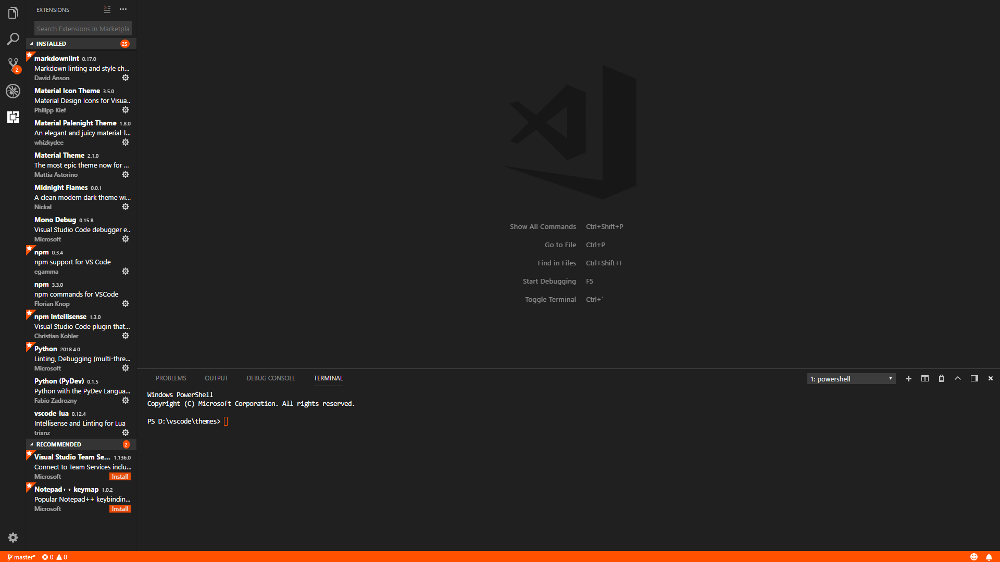

# Midnight Flames
## A Visual Studio Code Theme

## Description
A clean dark theme with vibrant orange accents.

If you are interested in contributing here is a list of things i need help with:

- Feedback
- Syntax Customization 

To get your ideas in, simply make a fork of this project and add your customizations. If i like what i see i'll add it into the next release and give credit to you in the description.